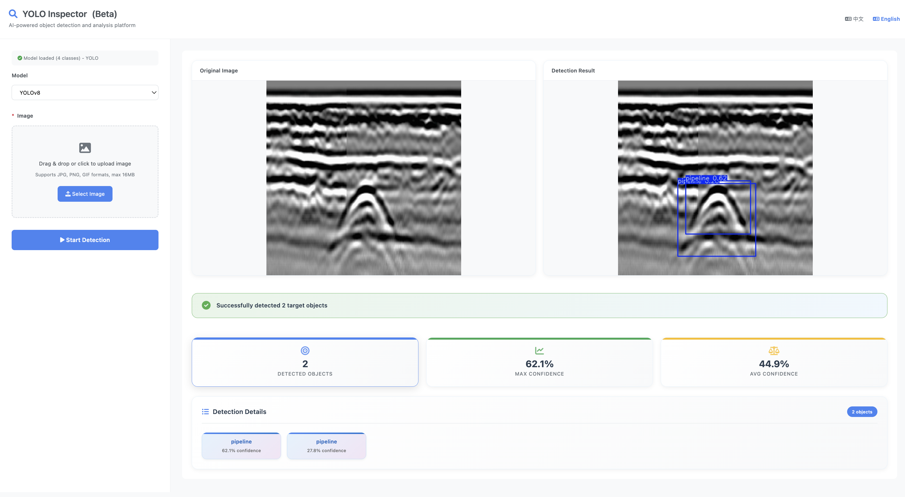

# YOLO Inspector

An intelligent object detection platform based on Flask and YOLOv8, providing a clean and beautiful user interface with powerful AI recognition capabilities.

## Features

- 🎯 **Smart Detection**: High-precision object detection based on YOLOv8 model
- 🌐 **Web Interface**: Modern responsive user interface  
- 🌍 **Multi-language**: Automatic language detection (Chinese/English)
- 📁 **Drag & Drop**: Support drag-and-drop files and click upload
- 📊 **Results Display**: Real-time display of detection results and confidence statistics
- 🖼️ **Visualization**: Comparative display of original and annotated result images
- 🔍 **Image Zoom**: Click to enlarge images for detailed viewing
- 📱 **Mobile Friendly**: Support for mobile and tablet device access

## Interface Preview



*YOLO Inspector main interface showcasing modern design and intuitive operation workflow*

### Interface Features
- **Left Operation Panel**: Model selection, image upload, language switching
- **Right Results Display**: Side-by-side comparison of original and detection results
- **Smart Statistics Cards**: Detected objects count, max confidence, average confidence
- **Detailed Detection List**: Shows all detected object categories and confidence scores
- **Image Zoom Function**: Click images to view full-screen high-resolution details
- **Responsive Design**: Optimized for both desktop and mobile devices

## System Requirements

- Python 3.8+
- 8GB+ RAM recommended
- GPU support (optional but recommended)

## Installation Guide

### 1. Clone and enter project directory

```bash
cd radar-vision-identify-ai/vision-detect-check
```

### 2. Create virtual environment (recommended)

```bash
# Create virtual environment
python -m venv venv

# Activate virtual environment
# Windows:
venv\Scripts\activate
# macOS/Linux:
source venv/bin/activate
```

### 3. Install dependencies

```bash
pip install -r requirements.txt
```

### 4. Verify model file

Ensure the `model/best.pt` file exists and is accessible. This is the trained YOLOv8 model file.

## Quick Start

### ⚡ If you encounter "ultralytics.utils" error

**Fastest solution**:
```bash
python quick_fix.py
```

### 📋 If you encounter model loading issues (PyTorch 2.6+)

**Complete fix script**:
```bash
python fix_torch_compatibility.py
```

### Start server

**Method 1**: Use smart startup script (recommended)
```bash
python run.py
```

**Method 2**: Direct startup
```bash
python app.py
```

### Access application

Open browser and visit: `http://localhost:5800`

## Usage Instructions

### 1. Upload Image
- Method 1: Click "Select Image" button to choose file
- Method 2: Directly drag image files to upload area

### 2. View Results
- System automatically processes uploaded images
- Displays comparison between original and detection result images
- Shows statistics like number of detected objects, confidence levels
- Lists all detected object categories and confidence scores

### 3. Language Switching
- System automatically detects browser language
- Manual switching via language buttons in top-right corner
- Direct access: `/en` for English, `/zh` for Chinese

### 4. Supported Formats
- Image formats: JPG, PNG, GIF, BMP, TIFF
- File size: Maximum 16MB

## API Endpoints

### File Upload Recognition
```
POST /upload
Content-Type: multipart/form-data

Parameters:
- file: Image file

Response:
{
    "success": true,
    "filename": "uploaded_filename",
    "detections": [
        {
            "bbox": [x1, y1, x2, y2],
            "confidence": 0.95,
            "class_id": 0,
            "class_name": "person"
        }
    ],
    "num_detections": 1,
    "original_image": "/uploads/filename.jpg",
    "result_image": "/results/result_filename.jpg"
}
```

### Get Model Information
```
GET /model_info

Response:
{
    "model_loaded": true,
    "model_path": "model/best.pt",
    "classes": {
        "0": "person",
        "1": "car",
        ...
    },
    "model_type": "YOLO"
}
```

### Language-specific Routes
```
GET /          # Auto-detect language
GET /en        # Force English
GET /zh        # Force Chinese
```

## Project Structure

```
vision-detect-check/
├── app.py                    # Flask main application
├── requirements.txt          # Dependencies list
├── README.md                # Chinese project documentation
├── README_EN.md             # English project documentation
├── run.py                   # Smart startup script
├── model/                   # Model files directory
│   └── best.pt             # YOLOv8 model file
├── templates/              # HTML templates
│   ├── index.html          # Chinese homepage template
│   └── index_en.html       # English homepage template
├── ui/                     # Interface screenshots
│   └── page.png            # Main interface screenshot
├── uploads/                # Upload storage (auto-created)
├── results/                # Result images storage (auto-created)
├── Dockerfile              # Docker configuration
├── docker-compose.yml      # Docker Compose configuration
└── deploy.sh              # Deployment script
```

## Configuration

### Model Configuration
- Model path: `model/best.pt`
- Supported formats: PyTorch (.pt), ONNX (.onnx)

### Server Configuration
- Default port: 5800
- Maximum file size: 16MB
- Debug mode: Enabled by default in development

### Modify Configuration
You can modify the following configurations in `app.py`:

```python
# File size limit
app.config['MAX_CONTENT_LENGTH'] = 16 * 1024 * 1024  # 16MB

# Model path
MODEL_PATH = 'model/best.pt'

# Allowed file types
ALLOWED_EXTENSIONS = {'png', 'jpg', 'jpeg', 'gif', 'bmp', 'tiff'}
```

## Docker Deployment

### Build and run with Docker

```bash
# Build image
docker build -t yolo-inspector .

# Run container
docker run -p 5800:5800 yolo-inspector
```

### Use Docker Compose

```bash
# Start service
docker-compose up -d

# Stop service  
docker-compose down
```

### Use deployment script

```bash
# Make executable
chmod +x deploy.sh

# Deploy
./deploy.sh build
./deploy.sh start
```

## Troubleshooting

### Common Issues

1. **ultralytics.utils module error**
   
   **Problem**: See "No module named 'ultralytics.utils'" or similar errors
   
   **Solution**:
   
   **Quick fix** (recommended):
   ```bash
   python quick_fix.py
   ```
   
   **Manual fix**:
   ```bash
   pip uninstall ultralytics -y
   pip install --no-cache-dir ultralytics>=8.0.196
   ```

2. **Model loading failure (PyTorch 2.6+ compatibility issues)**
   
   **Problem**: If you see errors like "Weights only load failed" or "WeightsUnpickler error", this is a PyTorch 2.6+ compatibility issue.
   
   **Solution**:
   
   **Method 1**: Use complete fix script (recommended)
   ```bash
   python fix_torch_compatibility.py
   ```
   
   **Method 2**: Manual PyTorch downgrade
   ```bash
   pip uninstall torch torchvision -y
   pip install "torch>=2.0.0,<2.6.0" "torchvision>=0.15.0,<0.20.0"
   ```
   
   **Method 3**: Code auto-fix included
   - Latest app.py includes compatibility fix code
   - Run application directly

3. **Other model loading issues**
   - Check if `model/best.pt` file exists
   - Confirm ultralytics package is installed correctly
   - Check Python version compatibility

4. **Dependency installation failure**
   - Upgrade pip: `pip install --upgrade pip`
   - Use mirror source: `pip install -r requirements.txt -i https://pypi.douban.com/simple/`

5. **GPU related issues**
   - CPU mode: Automatically uses CPU for inference
   - GPU mode: Ensure CUDA environment is configured correctly

6. **Port occupied**
   - Modify port number in app.py: `app.run(port=5801)`

### Performance Optimization

1. **GPU Acceleration**
   ```bash
   # Install GPU version PyTorch
   pip install torch torchvision --index-url https://download.pytorch.org/whl/cu118
   ```

2. **Model Optimization**
   - Use TensorRT to optimize model
   - Convert to ONNX format to improve inference speed

## Development

### Extended Features
- Add video file recognition support
- Integrate more pre-trained models
- Add user authentication system
- Implement recognition result database storage

### Code Structure
- `load_model()`: Model loading function
- `detect_objects()`: Core object detection function
- `upload_file()`: File upload processing route
- `model_info()`: Model information query route
- Language detection and routing logic

### Contributing
1. Fork the repository
2. Create a feature branch
3. Make your changes
4. Add tests if applicable
5. Submit a pull request

## License

This project is licensed under the MIT License. See LICENSE file for details.

## Support

If you encounter issues or have suggestions, please contact us through:
- Create an Issue to report problems
- Submit a Pull Request to contribute code
- Send email for technical questions

---

**Note**: Please ensure you have the right to use the provided YOLOv8 model files and comply with relevant license requirements. 